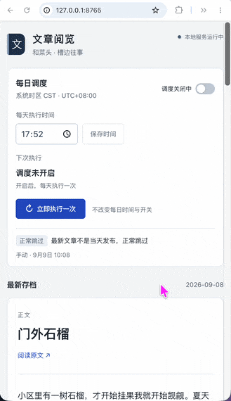

# 和菜头文章存档与分析

为了在每天阅读和菜头博客后，更方便地用大模型的 7W 分析校验自己的理解，我借助 AI 开发了这个项目，将正文抓取、存档与分析串联起来，省去手动复制、粘贴正文并发送给大模型的重复操作。

## 效果演示



## 为什么做这个项目

我每天都会读和菜头的博客，先用 7W 方法梳理自己的理解，再与大模型的分析结果对照，检查是否有遗漏或理解偏差。这里的 7W 指 where、when、what、why、how、which、who 七个维度。

之前，每次校验都需要手动复制文章正文，粘贴后发给大模型。这个项目把这段重复流程自动化：检查网站最新发布的一篇文章，仅在它属于系统当天时保存正文，再调用云端模型生成七项 JSON 分析。我可以在本地页面中阅读正文和分析结果，也可以设置每天的执行时间，让工具为自己的阅读与思考提供辅助。

## AI 如何参与开发与运行

这个项目是我使用 AI 完成的一次个人工具实践，不同工具在开发和正式运行中承担了不同角色：

| 工具 | 用途 |
|---|---|
| **Codex** | 用于项目开发，将阅读与分析需求实现为可运行的工具。 |
| **LM Studio** | 用于初期的本地大模型调试，验证正文分析流程。 |
| **Doubao-Seed-2.1-turbo** | 用于正式运行时的正文 7W 分析，通过火山方舟云端接口调用；当前代码使用的模型 ID 为 `doubao-seed-2-1-turbo-260628`。 |

项目经历了从本地模型调试到云端模型正式分析的过程，当前运行无需安装或启动 LM Studio。

## 开发过程中的设计取舍

- **相对路径与本地数据分离**：文档中的项目文件引用和运行示例使用相对路径，减少个人电脑目录信息暴露，也方便迁移到其他电脑；文章存档、运行日志和测试结果通过 Git 忽略规则留在本地。
- **密钥不上传仓库**：API Key 单独保存在本地密钥文件中，由 Git 忽略规则排除，不写入源码。正式分析会将文章正文发送到火山方舟云端，正文与分析结果则保存在本地。
- **正文抓取、分析与调度职责分离**：抓取与存档逻辑负责提取和保存正文，分析模块负责模型调用、七项结果校验与保存，调度模块负责执行时间与任务状态，并复用同一个单次运行入口。这种划分便于分别调试，也方便后续调整模型调用或调度规则。

## 技术栈

后端使用 Python，借助 BeautifulSoup 和 markdownify 提取网页正文并保存为 Markdown，通过 HTTP 调用火山方舟模型接口完成分析。管理页面使用原生 HTML、CSS 和 JavaScript，由 Python 标准库提供本地 HTTP 服务与调度，SQLite 保存调度配置和运行记录，无需前端构建工具。正文展示使用 Markdown 渲染与 bleach 清理 HTML，分析结果以 JSON 文件保存在文章目录中。

代码、安装方式、参数和 Agent 调用说明见 [工具使用说明](hecaitou-archiver/README.md)。

## 本地管理页面

在项目根目录启动服务，然后在浏览器打开 [http://127.0.0.1:8765](http://127.0.0.1:8765)：

```bash
/usr/bin/python3 -m pip install --user -r hecaitou-archiver/requirements.txt

nohup /usr/bin/python3 hecaitou-archiver/dashboard.py --output-dir './文章存档' > "dashboard.log" 2>&1 < /dev/null & disown
```

页面可设置每天的执行时间（精确到分钟）、开启或关闭调度、立即执行一次，并阅读本地最新文章及七项分析。初始调度关闭，默认待选时间为 `14:30`。关闭浏览器不会停止调度；后台 Python 服务须持续运行，退出服务或电脑休眠期间不执行，错过时间不补跑。

## 单次命令行运行

在当前项目根目录运行：

```bash
/usr/bin/python3 hecaitou-archiver/archive.py --output-dir './文章存档'
```

模型请求固定发送到火山方舟 Chat Completions 接口，默认使用 `doubao-seed-2-1-turbo-260628`。运行前需将 API Key 单独保存到 `hecaitou-archiver/secrets/ark_api_key.txt`；该文件已被 Git 忽略。无需安装或运行 LM Studio。

运行自动化测试（使用本机临时 HTTP 服务，不调用真实模型）：

```bash
/usr/bin/python3 hecaitou-archiver/selftest.py
```

`文章存档/`、`hecaitou-archiver/test-results/`、Python 虚拟环境和缓存均为本地数据，由 `.gitignore` 排除，首次克隆时不会包含这些目录。自动化测试会生成本地测试摘要和逐项记录。
